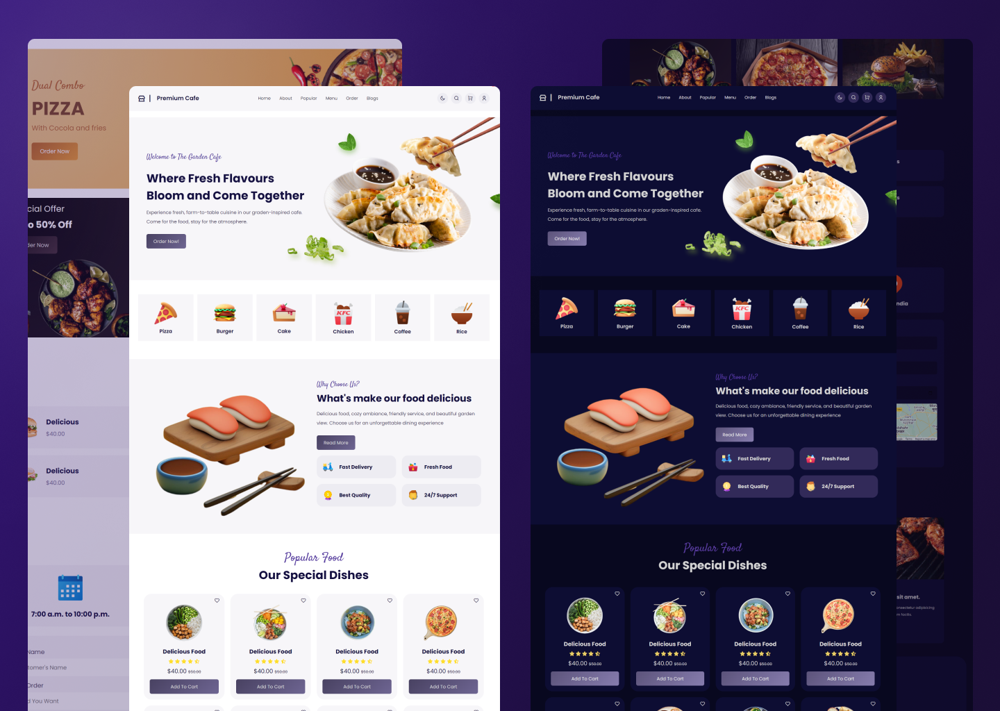

# Modern Cafe Website with Responsive Design and Light/Dark Themes

This repository contains the code for a responsive cafe website built using HTML, CSS, and JavaScript. The website features a login section for users to create accounts and log in, as well as a cart section for adding and managing items. Additionally, the website offers both light and dark themes to cater to different user preferences.

## Features

- **User Authentication**: Allows users to create accounts and log in to access additional features and personalize their experience.

- **Shopping Cart**: Provides a user-friendly interface for adding, removing, and managing items in the shopping cart.

- **Light and Dark Themes**: Offers a choice of light and dark themes for a customizable user experience.

- **Modern UI Design**: Utilizes modern design principles to create an appealing and user-friendly interface.

## Preview



## Technologies Used

- **HTML**: Responsible for the structure and content of the website.

- **CSS**: Used for styling and layout of the website, including responsiveness for various devices.

- **JavaScript**: Provides interactivity and functionality, including user authentication and cart management.

## How to Use

1. Clone the repository to your local machine using the following command:
   ```
   git clone https://github.com/Devsethi3/Responsive-Cafe-Website.git
   ```

2. Open the project folder in your preferred code editor.

3. Launch the `index.html` file in a web browser to view the website.

4. Customize the website as per your specific needs, such as adding your cafe's menu, logo, and branding.

## Contributing

If you'd like to contribute to this project, please follow these steps:

1. Fork the repository.

2. Create a new branch for your feature or bug fix.

3. Make your changes and commit them with clear, descriptive messages.

4. Push your changes to your forked repository.

5. Create a pull request detailing the changes you've made.

Feel free to reach out if you have any questions or feedback! We hope you find this project useful and enjoy using it for your cafe website.